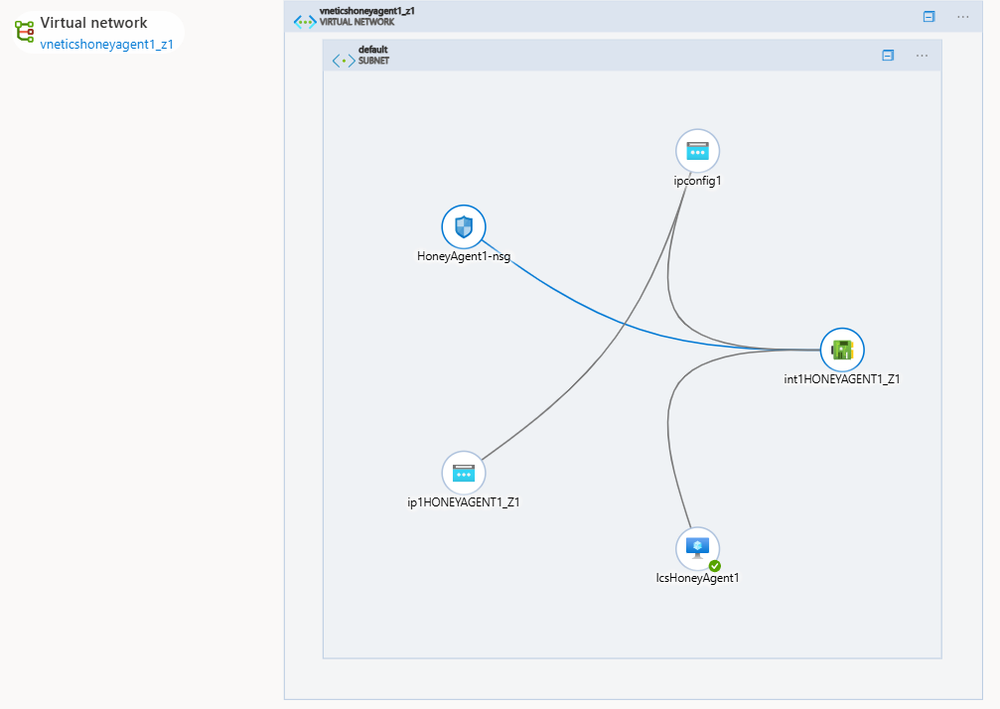

# Create Linux VM on Microsoft AZURE by REST API
 

Creating a Virtual Machine (VM) on Microsoft Azure using REST API leveraging the powerful of Azure HTTP-based API endpoints to automate the deployment of virtual machines.  
The Azure REST API provides developers and IT professionals with programmatic access to Azure resources, allowing them to create, configure, manage, and scale virtual machines without relying on the Azure Portal interface.
 
 
  
   
### Note : To deploy a virtual machine in Azure using the REST API, you must follow these steps in the specified order.
## Steps : 
1. Install Azure PowerShell on Windows, follow the [install_azure_powershell_on_windows.md](install_azure_powershell_on_windows.md)
2. Authentication to Microsoft AZURE using REST API [azure_account_auth_rest_api.md](azure_account_auth_rest_api.md)
3. Create resource group [create_ressource_group_on_azure_rest_api.md](create_ressource_group_on_azure_rest_api.md)
4. Create Virtual Network & Subnet [create_virtual_network_subnet_on_azure_rest_api.md](create_virtual_network_subnet_on_azure_rest_api.md)
5. Generate public IP address [generate_public_ip_on_azure_rest_api.md](generate_public_ip_on_azure_rest_api.md)
6. Create Network Intreface [create_network_interface_on_azure_rest_api.md](create_network_interface_on_azure_rest_api.md)
7. Associate Public IP Address to Network Interface [network_interface_ip_associate_on_azure_rest_api.md](network_interface_ip_associate_on_azure_rest_api.md)
8. Associate Network Interface to Security Group [network_interface_secgroup_associate_on_azure_rest_api.md](network_interface_secgroup_associate_on_azure_rest_api.md)
9. Storing SSH PublicKey [store_ssh_pubkey_on_azure_rest_api.md](store_ssh_pubkey_on_azure_rest_api.md)
10. Creat Linux virtual Machine [create_linux_vm_on_azure_rest_api.md](create_linux_vm_on_azure_rest_api.md)
11. Change ssh properties [change_ssh_properties_on_azure_rest_api.md](change_ssh_properties_on_azure_rest_api.md)

## For more details you can get your custom purpose to interact with AZURE platform : 
| Step | Description | Details | PowerShell script |
| --- | --- | --- | --- |
| 1 | Install Azure PowerShell on Windows, follow the | [install_azure_powershell_on_windows.md](install_azure_powershell_on_windows.md) | |
| 2 | Authentication to Microsoft AZURE using REST API | [azure_account_auth_rest_api.md](azure_account_auth_rest_api.md) | |
| 3 | Create resource group | [create_ressource_group_on_azure_rest_api.md](create_ressource_group_on_azure_rest_api.md) | [create_ressource_group.ps1](create_ressource_group.ps1) |
| 4 | Create Virtual Network & Subnet | [create_virtual_network_subnet_on_azure_rest_api.md](create_virtual_network_subnet_on_azure_rest_api.md) | [create_virtual_network.ps1](create_virtual_network.ps1) |
| 5 | Generate public IP address | [generate_public_ip_on_azure_rest_api.md](generate_public_ip_on_azure_rest_api.md) | [create_ip_address.ps1](create_ip_address.ps1) |
| 6 | Create Network Intreface | [create_network_interface_on_azure_rest_api.md](create_network_interface_on_azure_rest_api.md) | [create_network_interface.ps1](create_network_interface.ps1) |
| 7 | Associate Public IP Address to Network Interface | [network_interface_ip_associate_on_azure_rest_api.md](network_interface_ip_associate_on_azure_rest_api.md) | [associate_ip_to_interface.ps1](associate_ip_to_interface.ps1) |
| 8 | Associate Network Interface to Security Group | [network_interface_secgroup_associate_on_azure_rest_api.md](network_interface_secgroup_associate_on_azure_rest_api.md) | [associate_interface_to_network_security_group.ps1](associate_interface_to_network_security_group.ps1) |
| 9 | Storing SSH PublicKey | [store_ssh_pubkey_on_azure_rest_api.md](store_ssh_pubkey_on_azure_rest_api.md) | [create_pub_key.ps1](create_pub_key.ps1) |
| 10 | Creat Linux virtual Machine | [create_linux_vm_on_azure_rest_api.md](create_linux_vm_on_azure_rest_api.md) | [create_virtual_machine.ps1](create_virtual_machine.ps1) |
| 11 | Change ssh properties | [change_ssh_properties_on_azure_rest_api.md](change_ssh_properties_on_azure_rest_api.md) | [run_cmd_linux.ps1](run_cmd_linux.ps1) |

