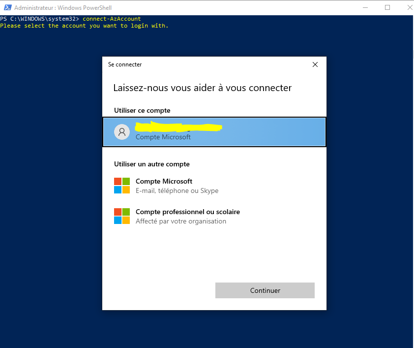
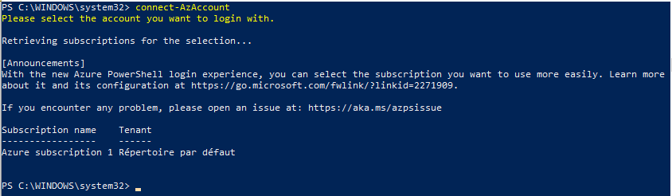
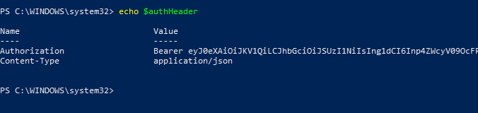

# Authentication to Microsoft AZURE using REST API

<br><br>
<b>Connect-AzAccount</b> 
Once we have installed Azure PowerShell on Windows, we are using `Connect-AzAccount` command to connect to Azure.<br><br>
1. Pop up will appear from Microsoft to authenticate using your Microsoft account.
<br><br>

2. After successful authentication, the result should be as bellow:
<br><br>

3. The following PowerShell scripts will prepare you to call the REST APIs once you have established a connection with your tenant.<br>
  Now, we are sending request to Azure to create the `$authHeader`<br>
  Try the following powershell code:<br>
    ```powershell
    $context = Get-AzContext
    $userProfile = [Microsoft.Azure.Commands.Common.Authentication.Abstractions.AzureRmProfileProvider]::Instance.Profile
    $profileClient = New-Object -TypeName Microsoft.Azure.Commands.ResourceManager.Common.RMProfileClient -ArgumentList ($userProfile)
    
    $token = $profileClient.AcquireAccessToken($context.Subscription.TenantId)
    
    $authHeader = @{
        'Content-Type' = 'application/json' 
        'Authorization' = 'Bearer ' + $token.AccessToken 
      }
    ```
    <br>
  To ensure that we have `$authHeader`, try to get value as following:
<br>
  Now we can use `$authHeader` to make the call.
