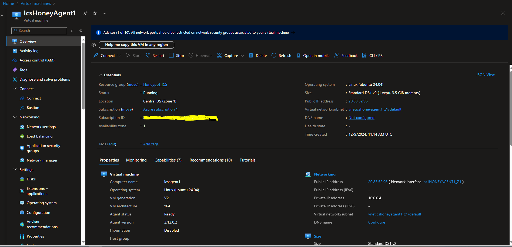

# Create Linux Virtual Machine
Followed the last authentication creation from the [running repository](azure_account_auth_rest_api.md), keep the similar `token` and `authHeader` values.<br><br>
1.  Set Mandatory parameters : 

  ```powershell
      $baseUrl = "https://management.azure.com/subscriptions/$SubscriptionId" + "/resourceGroups/$resourceGroupName"
      $apiVersion = "?api-version=2024-07-01"
      $url = $baseUrl + "/providers/Microsoft.Compute/virtualMachines/" + $VMname + $apiVersion
   ```

You should replace the following values : <br>
```
    $VMname = "IcsHoneyAgent1"
    $location = "centralus"
    $Username = "HoneyAgent1"
    $HostName = "icsagent1"
    $Password = "Kisj@450s+;pMaik"
    $NetworkInterface = "icshoneyagent1_z1"
    $subscriptionId="12e6b5b1-87o4-4f4e-ac46-d12f87a32099"
    $resourcegroupname="Honeypot_ICS"
```

Destination URL should be  : <br>
`https://management.azure.com/subscriptions/12e6b5b1-87o4-4f4e-ac46-d12f87a32099/resourceGroups/Honeypot_ICS/providers/Microsoft.Compute/virtualMachines/IcsHoneyAgent1?api-version=2024-07-01`<br>

2.  The body section will be as following :<br>
      For more information about AZURE API options for Virtual Machine creation : [Azure Help](https://learn.microsoft.com/en-us/rest/api/compute/virtual-machines/create-or-update?view=rest-compute-2024-07-01&tabs=HTTP)
      ```powershell
      $body='{
        "location": "centralus",
        "type": "microsoft.compute/virtualmachines",
        "zones": ["1"],
        "properties": {
          "hardwareProfile": {
              "vmSize": "Standard_DS1_v2"
          },
          "storageProfile": {
            "imageReference": {
              "sku": "server",
              "publisher": "Canonical",
              "version": "latest",
              "offer": "ubuntu-24_04-lts",
      		"exactVersion": "24.04.202411030"
            },
            "osDisk": {
              "caching": "ReadWrite",
      		"osType": "Linux",
              "managedDisk": {
                "storageAccountType": "Premium_LRS"
              },
              "name": "HoneyAgent1_OsDisk_1",
              "createOption": "FromImage",
      		"deleteOption": "Delete",
      		"diskSizeGB": 30
            }
          },
          "osProfile": {
            "adminUsername": "HoneyAgent1",
            "computerName": "icsagent1",
            "adminPassword": "$Kisj@450s+;pMaik",
            "linuxConfiguration": {
              "provisionVMAgent": true,
      		"disablePasswordAuthentication": false,
      		"ssh": {
                "publicKeys": [
                  {
                    "path": "/home/HoneyAgent1/.ssh/authorized_keys",
                    "keyData": "ssh-rsa AAAAB3NzaC1yc2EAAAADAQABAAACAQCS0aUbl+LW31IASEinkd9Z+WeNO7udJA551HDF7tpA/rdxDcrAkWOgJJ35cCF3hbjTmr03rB/kgOUbWMvctArTlcRfXZfXKZNLd/KVKWAHEnyUJWDs66MSqHqJQDb7dVheQV0SForVCkhY+z7ZHTPmwKMbLWc/5qe0N8VNX4pkXPrIOyqVKW4HwmWuRiaqq1m3XvnjCR/jFJGH83f6f7tq5AsnTpB+i2nWFvdqOdvsGVjGZCN2XXItGWgTjF3LnqFO4EcoROrywOxZ+3ZD5nYBi/zjWTNdIwA6Q/KWM7TDUF8tsAz9NRRKQtoOgFN6VGXHuZkuwoFaTcfszRK2EnJSRmVXHcuUqmLvHJyDXmEKjOr67vArMty9AEVgXDKWvILupkmX1Z9mqKtp4SA4edXLq/kznrI6VR4fBD24Ta4YCIiebYX8oMUM/pH5chxTjaXsNYUVD4VTf44l7boKi6mUesEKCHF6zvFjrO0wgyTMYK4ojrzg/5m3Ywks5K/rafRkV+eyD25RJHAfq1AsdxEUmL8MMyRxrPA5r/juGD8tsjiLBhuWFz0C6FL4QnC7SvjC5ppoUYtF8/ocNA5ZThnfoOrru8QYtqHv6+88uOZvB9y0/XvOeo2a12f+sACPFCb7qE+VQj+UAQ4kQD2CGRvvsDadbdP1yRFolLLL2gXZuQ== HoneyICSAgent1"
                  }
                ]
              },
              "patchSettings": {
                "patchMode": "ImageDefault",
      		  "assessmentMode": "ImageDefault"
              }
            }
          },
          "securityProfile": {
            "uefiSettings": {
              "secureBootEnabled": true,
              "vTpmEnabled": true
            },
            "securityType": "TrustedLaunch"
          },
      		
          "networkProfile": {
            "networkInterfaces": [
              {
      		"id": "/subscriptions/12e6b5b1-87o4-4f4e-ac46-d12f87a32099/resourceGroups/Honeypot_ICS/providers/Microsoft.Network/networkInterfaces/int1HONEYAGENT1_Z1",
                "properties": {
                  "primary": true
                }
              }
            ]
          }
        }
      }'
     ```

3.   Call Invoke-RestMethod using PUT request:
       ```powershell
        Invoke-RestMethod -Uri $url -Headers $authHeader -Method PUT -Body $body
       ```

     #### You can download full Poweshell script [create_network_interface.ps1](create_network_interface.ps1) 
      You should replace the following values : <br>
      ```
        -  $VMname
        -  $location
        -  $Username
        -  $HostName
        -  $Password
        -  $NetworkInterface
        -  $subscriptionId
        -  $resourcegroupname
      ```

4.  Check Virtual Machine on AZURE Portal
    Open [AZURE Portal](portal.azure.com)<br>
    Navigate to <b>home</b> > <b>Virtual Machines</b> > <b>IcsHoneyAgent1</b> 
    
