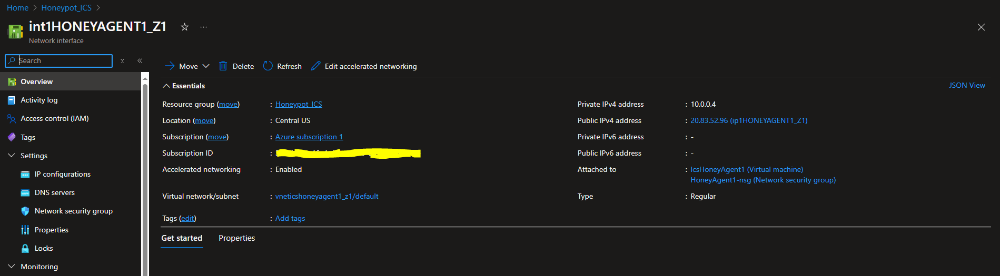

# Create Network Interface
Followed the last authentication creation from the [running repository](azure_account_auth_rest_api.md), keep the similar `token` and `authHeader` values.<br><br>
1.  Set Mandatory parameters : 

  ```powershell
    $baseUrl = "https://management.azure.com/subscriptions/$SubscriptionId" + "/resourceGroups/$resourceGroupName"
    $apiVersion = "?api-version=2024-05-01"
    $url = $baseUrl + "/providers/Microsoft.Network/networkInterfaces/" + $NetworkInterfaceName + $apiVersion
   ```

You should replace the following values : <br>
```
  $virtualNetworkName = "vneticshoneyagent1_z1"
  $NetworkInterfaceName = "int1HONEYAGENT1_Z1"
  $subscriptionId="12e6b5b1-87o4-4f4e-ac46-d12f87a32099"
  $resourcegroupname="Honeypot_ICS"
```

Destination URL should be  : <br>
`https://management.azure.com/subscriptions/12e6b5b1-87o4-4f4e-ac46-d12f87a32099/resourceGroups/Honeypot_ICS/providers/Microsoft.Network/networkInterfaces/int1HONEYAGENT1_Z1?api-version=2024-05-01`<br>

2.  The body section will be as following :<br>
      For more information about AZURE API options for IP Address creation : [Azure Help](https://learn.microsoft.com/en-us/rest/api/virtualnetwork/network-interfaces/create-or-update?view=rest-virtualnetwork-2024-05-01&tabs=HTTP)
      ```powershell
        $body='{
        	"location": "centralus",
        	"type": "Microsoft.Network/networkInterfaces",
            "properties": {
        		"ipConfigurations": [
        			{
        				"name": "ipconfig1",
        				"properties": {
        					"subnet": {
        						"id": "/subscriptions/12e6b5b1-87o4-4f4e-ac46-d12f87a32099/resourceGroups/Honeypot_ICS/providers/Microsoft.Network/virtualNetworks/vneticshoneyagent1_z1/subnets/default"
        					},
        					"primary": true,
        					"privateIPAddressVersion": "IPv4"
        				}
        			}
        		],
                "dnsSettings": {
                    "dnsServers": [],
                    "appliedDnsServers": []
                },
        		"ddosSettings": {
                    "protectionMode": "Disabled"
                },
                "enableAcceleratedNetworking": true,
                "vnetEncryptionSupported": false,
                "enableIPForwarding": false,
                "disableTcpStateTracking": false,
                "hostedWorkloads": [],
                "tapConfigurations": [],
                "nicType": "Standard",
                "allowPort25Out": false,
                "defaultOutboundConnectivityEnabled": false,
                "auxiliaryMode": "None",
                "auxiliarySku": "None"
            }
        }'
     ```

      
3.   Call Invoke-RestMethod using PUT request:
     ```powershell
      Invoke-RestMethod -Uri $url -Headers $authHeader -Method PUT -Body $body
     ```
  
  #### You can download full Poweshell script [create_network_interface.ps1](create_network_interface.ps1) 
  You should replace the following values : <br>
  ```
  -    $subscriptionId
  -    $NetworkInterfaceName
  -    $resourcegroupname
  -    $virtualNetworkName
  ```

4.  Check Network Interface on AZURE Portal
    Open [AZURE Portal](portal.azure.com)<br>
    Navigate to <b>home</b> > <b>Network interface</b> > <b>int1HONEYAGENT1_Z1</b> 
    
