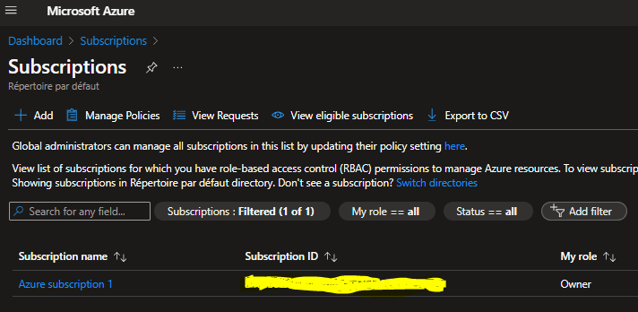

# Create RessourceGroup on AZURE using REST API
After successfully authentication to Microsoft AZURE via Powershell, we should get Subscription ID in order to create Resource Group: 

1.  Open [Azure Portal](https://portal.azure.com/)
2.  Navigate to <b>Dashboard</b> > <b>Subscription</b>
3.  Get Subscription ID, the format should be like this '<b>12e6b5b1-87o4-4f4e-ac46-d12f87a32099</b>'<br>
    <b>Note</b>: 12e6b5b1-87o4-4f4e-ac46-d12f87a32099 is just for demonstration purpose.
  

4.  Store Subscription ID into the variable such as: `$subscriptionId="12e6b5b1-87o4-4f4e-ac46-d12f87a32099"`
5.  Generate Resource Group Name as example: `$resourcegroupname="Honeypot_ICS"`
6.  Use the last API Version: `2024-08-01` for URL call.<br>
7.  Use the following to generate token
   ```powershell
  # Get token
  $context = Get-AzContext
  $userProfile = [Microsoft.Azure.Commands.Common.Authentication.Abstractions.AzureRmProfileProvider]::Instance.Profile
  $profileClient = New-Object -TypeName Microsoft.Azure.Commands.ResourceManager.Common.RMProfileClient -ArgumentList ($userProfile)
  $token = $profileClient.AcquireAccessToken($context.Subscription.TenantId)
   ```
8.  Set subscriptionID and resource group name, and identify Request URL<br>
    Note : for Azure Resource Manager provider APIs we use https://management.azure.com/<br>
    The final USRL should be like this :<br> `https://management.azure.com/subscriptions/12e6b5b1-87o4-4f4e-ac46-d12f87a32099/resourceGroups/Honeypot_ICS?api-version=2024-08-01`
   ```powershell
    $subscriptionId="12e6b5b1-87o4-4f4e-ac46-d12f87a32099"
    $resourcegroupname="Honeypot_ICS"
    $baseUrl = "https://management.azure.com/subscriptions/$SubscriptionId" + "/resourceGroups/$resourceGroupName"
    $apiVersion = "?api-version=2024-08-01"
    $url = $baseUrl + $apiVersion
   ```
9.  Basically, we are getting information from Azure to create the `$authHeader`
    ```powershell
    $authHeader = @{
        'Content-Type' = 'application/json' 
        'Authorization' = 'Bearer ' + $token.AccessToken 
        'host'="management.azure.com"
     }
    ```
10.  PowerShell can working with JSON, which is great since the POST and PUT calls require JSON input. On this example, the location will be "US East" `eastus` and tag is `Honeypot_1`:
     ```powershell
        $body='{
            "location": "eastus",
             "tags": {
                "tagname1": "Honeypot_1"
            }
         }'
     ```
