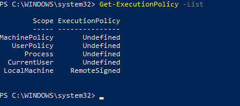
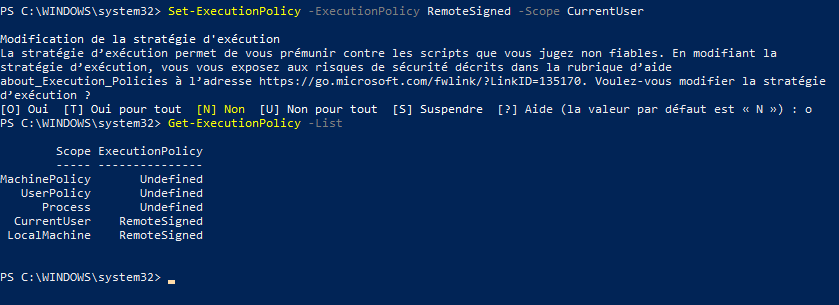

# Install Azure PowerShell on Windows 
Azure PowerShell is a command-line utility that enables users to manage Azure resources directly from the command line. This robust tool is designed for automating tasks, provisioning resources, managing user accounts and policies within Azure, and troubleshooting various issues.

#### Prerequisites
1. Update Windows PowerShell version to [5.1](https://learn.microsoft.com/en-us/powershell/scripting/windows-powershell/install/installing-windows-powershell#upgrading-existing-windows-powershell)
2. Install .NET Framework [4.7.2 ](https://learn.microsoft.com/en-us/dotnet/framework/install)
3. Check the PowerShell execution policy:
    ```powershell
         Get-ExecutionPolicy -List
    ```
   <br><br>

5. Set the PowerShell execution policy to remote signed:
    ```powershell
    Set-ExecutionPolicy -ExecutionPolicy RemoteSigned -Scope CurrentUser
    ```
   <br>
   <b>Note</b> : ExecutionPolicy of 'CurrentUser' Scope should be changed to 'RemoteSigned' as shown in the image above.
   <br>
   
5. Set the PowerShell execution policy to remote signed:
    ```powershell
    Set-ExecutionPolicy -ExecutionPolicy RemoteSigned -Scope CurrentUser
    ```

#### Installation
1. Run the following command by using Install-Module :
    ```powershell
         Install-Module -Name PowerShellGet -Force
         Install-Module -Name Az -Repository PSGallery -Force
    ```
